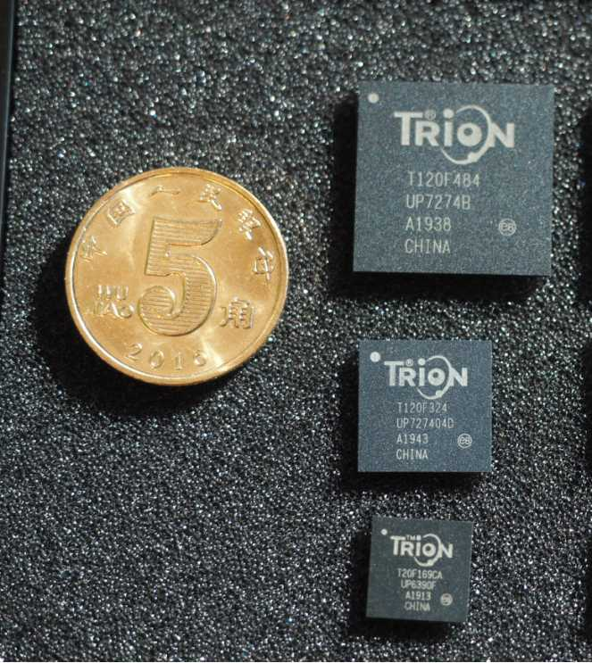
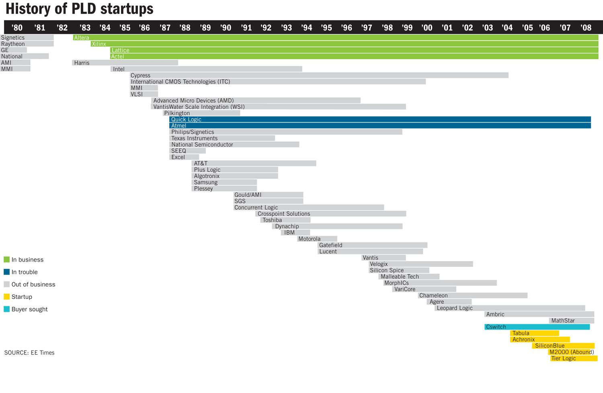

# 神秘的FPGA公司Efinix

Dec-19-2019

Wisdomz

Trion FPGA picture:



__一种新型的FPGA结构__

## CHAPTER 1 多伦多大学计算机应用专业

在1998年代的时候，半导体中的FPGA公司还是有不少，但是Altera借助自己的MAX系列，以及FLEX系列在市场上已经表现突出，那个时候的Lattice急需要自己也拥有FPGA的基因，以摆脱自己只有CPLD的困境。XILINX公司当时已经势头很猛，基本上说到FPGA，大家都直接理解为Xilinx公司的产品。
Altera在2000年的时候，开始了一种MAX和FLEX体系相结合的产品，起了一个名字叫APEX，而且他们锐意革新，软件也开始不再满足于那种单个用户的使用。开发了新的软件名字就是Quartus，而且里面有个按钮，可以表现的和以前Max+plus-II一样的界面来取悦老的用户。

但是这个APEX结构的可编程器件在编译过程中，不能很好的完成布局布线，尽管表面上看来非常先进的芯片，竟然不能发挥性能， Altera努力了很长时间也没有改善。
加拿大多伦多大学的Jonathan Rose一直致力于FPGA结构的设计和软件布局布线方面的研究， 他们好像发现了Altera碰到了这个头疼的问题， 可是在当时加拿大并没有一家半导体公司在研发FPGA或者PLD，可是Altera觉得可以让Rose教授的团队来试一试。
事情的结果是， Jonathan开了一家专门设计FPGA结构的EDA公司， 这家公司后来被Altera收购了， 此后Altera公司的FPGA结构设计以及软件都如虎添翼，尽然后来反超Xilinx，成为业内翘楚。 有关Jonathan先生的信息可以参考

[Jonathan Rose website](http://www.eecg.toronto.edu/~jayar/)

http://www.eecg.toronto.edu/~jayar/

Jonathan有带了不少学生，这些学生不少都是FPGA行业中很重要的学说创立和遂行者， 网站上也罗列了他的学生以及现在的一些成就。

http://www.eecg.toronto.edu/~jayar/former-graduate-students.html

在FPGA行业中最有影响力的学生之一 Vaughn Betz 他在FPGA行业中最有影响力的学生之一，他的自我介绍中有一段辉煌的经历

The VPR toolset and methodology developed by Dr. Betz have become the standard for FPGA architecture research and the comparison point for CAD optimization quality, and have been used by over 180 companies and 1100 universities. Dr. Betz co-founded Right Track CAD to commercialize his research in 1998 and over the next two years helped grow the company to 10 engineers and several million dollars in yearly revenue. In 2000, Right Track CAD was acquired by one of its customers, Altera Corporation (a fortune 500 semiconductor company). Dr. Betz held several leadership positions within Altera over the next 11 years,
还有一位是Altera公司的大学教育计划的推动者，[Steven Brown](http://www.eecg.toronto.edu/~brown/)

还有一位是Tony Ngai， 是EFINIX的魏启杰，EFINIX公司的CTO
现在FPGA的结构设计以及布局布线软件的研发前沿也基本上继续在多伦多大学不断提高， 成为这个行业最重要的理论实践的推动源头。


实际上在2008年以前， 有人统计至少有48家公司先后涉及可编程器件行业， 但是大部分都折戟沉沙，杳无踪影。

More FPGA Startups by 2008 from website:



这幅图片的来源出处

http://www.ocoudert.com/blog/wp-content/uploads/2009/10/History_of_PLD_startups.gif


__Silicon is not Enough__

--John Daane CEO of Altera

含义就是只有芯片是不足够的，你必须要有很好的逻辑开发软件，而且这个开发软件特别是基本上接触到EDA软件的很多方面，开发成本和试错成本都非常高， 而且整个行业竞争迭代很快，不仅仅在工艺上有进步，结构设计上，benchmark的选择上，IP的集成方面，可以说基本上每个环节方面都不能犯错。 而且开发一个全新的产品基本上都要3年的开发周期。加上要不断维护升级复杂的开发工具。总而言之，活下来的一定是凤凰了。
那么2008年以后，还是有几家公司进入这个行业， 比较著名的有Tabula， SiliconBlue，Tabula在烧光了10亿美元之巨后消失了，SiliconBlue也被Lattice收购， 所以你想进入这个行业，而且活下来，至少你要敢于挑战现有的环境，并且确实有自己的创新之处。同时行业的很多既有成果和习惯也要考量，尽可能利用已有的资源，而不是重复造轮子。

#

EFINIX公司的CEO张少逸早年从香港去往美国留学，是**Altera的高端FPGA的Stratix产品总监**，期间和魏启杰先生一起负责过**Hardcopy**的研发工程工作。他们后来一起创立了EFINIX公司，同时请来了曾经参与Maxplus-II的研发工作的Jay来助阵。
在2015年就在中国开始他们的芯片制造计划，与SMIC中芯国际合作，在上海封装，全部产业链扎根中国.
EFINIX香港公司作为运营主体，以马来西亚槟城作为主要研发基地，在香港也建立软件和技术工程资源。吸引中国资本。有多家著名VC投资。


魏启杰先生作为CTO，早年尽管有非常多的想法，但是这些想法必须经过长时间的建模测试和测试芯片的验证开发。历经6年，打破行业固有思维，开创和验证了全新的一种FPGA的创新架构。

FPGA业内的神话，通常在一个发展相对时间很久的行业， 不太容易有创新的东西，因为有不少专利壁垒，同时人们没有太多资源去验证这种创新是否有效， 在加上可能很多创新都要摈弃过去一些已经取得的成绩，EFINIX作为一家新公司，他可能没有这方面太多的包袱。
他们相信，

**没有创新，难以生存**

现在的FPGA基本上都是孤岛型的结构体系， 甚至很多芯片采用LUT6的结构，将4个，9个，或者更多个这样的巨型查找表集成在一个小区间内， 希望这些同样功能的LUT6放在一起， 可以快速解决一些8bit，9bit的寄存器组或者是计数器，移位计数器等。 因此随着芯片的规模不断上升， 逻辑资源组之间的连线资源也快速上升， 有时可以想象买来的可编程芯片上可能路由的资源超过了实际有效的逻辑资源。 我们用一个城市来做个形象的比喻。

随着城市的扩大， 就必须建立更宽的道路， 道路间要建立不少更大的交叉立交， 而且这些立交的层次都可能很复杂，还需要更多的交通灯， 以及匝道来汇聚和分开车流。 这些实际上和一块FPGA的结构非常类似， 这些你可以自然联想到， 芯片规模越大， 就只有两个办法来完成逻辑之间的互联互通。 要不就是把走线的资源增加很多层， 要不就是把芯片做到更大的面积来增加布线。 甚至两个方面都要加强。
这些做法直接导致了芯片更大的功耗以及更大的晶片面积。 通过不断分析和模拟各种设计在以前这种结构的FPGA上的适配， 发现有部分区域逻辑资源消耗多， 有些区域的连线消耗多， 这样即使有其他地方有空余布线资源， 但是也不能带来很好的折中统一。 导致芯片在越高的使用率情况下， 时序条件越难符合预期目标。 要不就是选择一个更大容量的芯片来缓解这种情况。 很多设计者采用比预计需要资源大30%的FPGA来进行设计。 这都是成本， 这都是功耗， 这些也都是时延。


 为了缓解这种矛盾， Tony想到一个好的办法， 概括起来有以下两个原则。

1.  首先采用更加小的细粒度结构，去掉太多逻辑组和逻辑组之间接入和扇出的连接开销， 让逻辑和逻辑之间的连线显著缩短， 即使增加了一些跳线，但是整体时延时和过去的结构相当， 未来更好适应这种想法，

2.  接着又将逻辑资源和布线资源可以进行相互的转化， 使得相关逻辑尽可能聚合在一起， 提高时序相应， 这样我们可以想象成编译软件就如同一家建设公司， 需要路的地方， 可以拆迁房屋，把道路扩宽， 有些地方，可以将道路修成房子。 这样两种方式的结合， 最终可以使得EFINIX的Trion系列FPGA只是需要7层金属走线层，而传统FPGA结构需要12-14层以上。

同时，由于采用细粒度结构， 消除了很多不必要的走线接入和扇出开销， 使得芯片在同等规模下，比传统结构有1/3到1/2的面积缩小优势。

最终**EFINIX**的**Trion**系列FPGA不仅具有很小的功耗， 同时兼具更小的封装。 转而也极具成本优势。 同时又采用了SMIC公司的40nm低功耗制程。 使得T8可以支持8K逻辑容量的FPGA具有30mW， T120可以容纳115K逻辑容量的FPGA的典型应用功耗只有1.3W。 这就是公司在FPGA领域中最大的创新。 因为不采用这种创新， 难以撼动业内巨头的行业地位， 也很难脱颖而出获得竞争优势。

为了取得更低的功耗， 同时聚焦视频和相机市场， FPGA中集成了**MIPI**的硬核接口，**DDR3控制器**也采用硬核。 这种设计方法进一步缩小芯片尺寸， 并且进一步降低功耗。

EFINIX不仅在逻辑器件的架构设计方面具有前瞻性，Tony在FPGA的路由算法布局方面可以和自己设计的结构进行更好的融合，从而完成效能的统一需求。说到可编程器件的CAD工具，大家都知道Foundation，ISE，Quartus-II，EFINIX自主完成了整个EDA软件设计工具。Jay在EDA领域多年经验积累，深刻体会到在不断推出新器件的时候能够快速迭代以及尽快缩短上市时间对公司本身以及客户都至关重要。

EFINIX的设计软体名字叫**Efinity**，软件的Logo非常具有东方文化特色的二龙戏珠，寓意FPGA的公司不仅要有强大的硬体架构，同时软件也是重要的立基之本。 Efinity软体中的P&R算法依据自己的产品架构设计，与很多软件不同的是由于结构的特殊性，软件支持**Hybird的P&R**的算法。

采用这种革新的架构以及自己本身具有的逻辑布局和逻辑路由可以互换的特点，EFINIX公司成功地打破了以往FPGA结构设计的神话， **采用比竞争对手近乎一半的面积优势就可以设计同等容量的FPGA产品**。 而且这种结构的好处也对新产品的推出可以有效缩短开发时间。 在一年的时间里， 用对手不到1/10的人力资源就完成了第一代Trion产品的开发。 EFINIX给这种创新的结构赋予一个有联想的名字－－**Quantum**，如同量子技术的神奇寓意。

我们对由此带来的变革有如下总结：

* 同等工艺条件下， 面积缩小2倍或以上
* 功耗减少一半
* 芯片采用了7层金属工艺
* 可以采用无需任何定制的通用硅制程
* 具有和相同工艺条件下的FPGA同等的逻辑速度性能
* 可以采用Hybird的布局布线

现在的FPGA应用端，大家都期望做到大的逻辑容量，但是面积要小，不能牺牲性能，同时功耗要极具竞争。 作为初创公司，使用者总是有质量方面的担忧，但是这些产品的可靠性和一致性，最终需要具有完善设计流程的有经验的团队来保证。 而且软件的研发需要足够的时间测试。 EFINIX公司在过去的6年里投入非常多的时间验证后，才能在短短的一年时间内推出完整的**Trion系**列。

## CHAPTER 2 产品的对比

目前开发产品，不仅要看当下的产品是否符合市场需求， 同时外衍的产品也要具有快速的开发能力， 业界都有采用平台式开发的方法。 EFINIX公司利用统一的架构，可以快速在软件层面进行产品的预研，因为采用了逻辑可以转化路由的特殊结构，可以很好弥补芯片在规模增大，但是路由资源规划不足的不可逆转的开发困境。 在没有开发好产品之前，基本就可以预测产品的性能以及对Benchmark用例的测试。 在过去的FPGA公司的产品开发中， 40nm工艺的产品基本上到100K逻辑资源就很难继续沿用同样的工艺。 但是由于Trion系列在晶片尺寸具有竞争力的优势下，EFINIX依旧可以在40nm的成熟工艺上， 开发165K，200K的逻辑资源的器件。

现在的开发手段，必须具有较好的性能预判能力， 优秀的设计团队总是充分利用公司的CAD进行下一代FPGA的工艺演进和当前竞争对手以及自身的产品进行性能和功耗的预估。 以取得最好的产品投资效益比。
我们显示了开发中用到的一部份**Benchmark**设计，对标竞争对手的产品，有下列性能以及利用率的比较。

插入“延展性对比” 图片
#

**Interface Designer 的接口精灵**

作为FPGA领域的后来者， 尽管FPGA是可以编程的芯片，

**但是聚焦市场，具有更高的性价比，才可能在新的设计中，与竞争对手的同类产品价格上拉开距离。**

EFINIX的Trion系列FPGA针对目标市场， 将常用功能进行硬核化IP设计的方法， 一方面有效降低芯片的尺寸， 一方面可以降低功耗。 同时采用了相对精简的功能在IO的支持上， 有效降低IO的片上面积，可以在较小的芯片上集成数量更多的IO。

例如是第一个将MIPI CSI-2控制器硬核化， 在40nm的低成本FPGA上可以提供MIPI接口的集成， 而且开发者只需要配置自己需要的协议参数， 就可以很好的和大部分流行的图像Sensor进行对接，因为现在AI SoC的发展非常迅速， AI-SoC的图像Sensor接口也以MIPI接入为主， 多sensor的应用尽管在手机上已经得到普及， 在嵌入式，AI应用上也出现更多的Sensor接入， 因此**Trion系列的FPGA可以支持2个到3个MIPI的接入**， 同时汇流或者交叉到AI SoC的MIPI接口， 可以起到扩展MIPI或者交叉MIPI的能力。
还有一个很好且很通用的例子，不同的芯片规模集成了不同位宽的DDR3硬核控制器， 不仅功耗降低， 也支持不同带宽的FPGA需要。

Trion系列针对FPGA的LVDS应用， 另辟蹊径， 业内的通用做法是每个IO都尽可能支持LVDS， 看起来灵活的配置， 但是IO在晶片上所占用的面积过大， 导致不能有效增加IO，功耗也是一个挑战。 Trion系列的LVDS开始就进行预先定义了固定的输入输出方向。 确保最小的IO面积， 可以降低功耗，而在LVDS的支持数量上也聚焦Sensor的应用， 以13对LVDS的Rx为基础考量，**确保多数图像应用不仅可以采用LVDS的接入， 也可以采用MIPI的接入，** 真正做到一个sensor manager的功能设计。

以上的设计更新，和实际的HDL设计只是信号流的对接， 并不涉及HDL的设计方法， 同时为了迎合SoC的设计方法学， 将数字逻辑核心和外设接口部分进行隔离抽象，分隔开发，EFINIX的Efinity软件采用了业内独特的接口设计精灵。 将所有的硬核化的IP都统一放在**Interface Designer**的设计界面， 而专注于逻辑设计的数字核心属于核心逻辑设计， 这样的设计模块隔离抽象， 可以极大降低平台开发工作量，FPGA的产品如果按照FPGA的逻辑容量以及IO接口两个因素来进行分类，那么，可以认为FPGA的一个系列产品就是不同器件逻辑容量和不同接口种类数量上两个组合设计，而Interface designer的设计分离，可以让这两个因素进行快速组合匹配。 因为同样密度的FPGA产品可能有不同的外设， 使用者可以看到Interface designer中自动显示可以支援的硬核IP的支持。

这样做的另外一个好处， 当有大型客户采用SiP或者eFPGA的项目时， 可以只是改动Interface designer就可以完成定制eFPGA软件的开发。现在interface designer接口精灵中会根据不同器件以及同样器件的不同封装有下面的支持


插入照片


#
**EFINIX**在2019年的11月推出40nm功耗极具竞争力的产品T120， 这款产品显示了EFINIX作为业内新秀，展示了可以推出大于100KLE的产品，同时可以将利用率提高到接近100%， 而且将功耗限制在1.2W到1.5W之间。 比相当于同级别工艺的竞争对手功耗低一半，甚至是竞争对手的1/3。封装更是12x12mm的FBGA，产品在体积受限，功耗受限的应用中大受青睐。

## CHAPTER 3: 中国市场突破

中国无疑已经成为世界FPGA开发者最多，也是FPGA应用最大的单一市场，中国的应用市场机会已经占到FPGA的全球市场的40%以上。 如何作为一个后来者要想在中国市场取得一席之地， 必须要有适合中国市场和应用者的产品和技术资源。

EFINIX深知时间就是生命， 效率就是金钱的中国市场原则，不能快速开发以及快速支持客户， 将没有办法生存。 除了具有打破神话的创新，在消费者使用者心中，快速建立产品和企业形象最适合的原则
中国市场，唯快不破
EFINIX在过去的12个月里， 依靠35个人的团队，成功推出8款产品， 从4K逻辑密度3x3mm 的产品扩展到120K的FBGA576的16x16mm的大容量产品。 而且编译综合，布局布线软件基于自主开发。真正体现了最快的交付速度。 而且在接下来的时间， 即将有更大规模的165K和200K的产品面世。 为今天的需要边缘AI的应用提供解决方案。

### 目标市场
同时，面对快速变化的中国市场， 以及多家FPGA公司的充分竞争， 目前EFINIX针对特定市场，配合软件的IP，聚焦应用，已经在如下的市场中获得客户的认可。

* 工业相机市场
* 特殊相机应用HDR
* VR 眼镜
* 电容笔
* 工业PLC
* 工业伺服控制
* 工业激光控制
* 显示拼接控制


## CHAPTER 4: RISCV的应用
**RISCV**是最近全球嵌入式应用的大热门话题，因为其具有的开源性以及结构简单，能效比优秀，短短两年，在中国市场已经出现了多家公司推出RISCV体系的MCU，给ARM体系为主的固有MCU市场带来了新的挑战。 而且RISCV也可以快速搭配多种外设资源，是AIoT的应用中非常好的选择。 很好弥补了碎片化应用市场的需求。

由于FPGA极具灵活性的特点，在过去的FPGA领域的行业先导中都有自己的软核CPU的工具，例如Altera公司的NiosII，以及Xilinx公司的MicroBlazer，其中设计界面和理念各有千秋， 给后来的FPGA公司带来极大的挑战， 因为设计中有需要软核的设计非常多。 后来者的CPU软核必须要具有不仅使用容易，快速上手，而且性能可以有效竞争，这样的的选择其实并不多。

RISCV的出现极大方便了在FPGA中软核的需求， 这里面临的一个重要问题， RISCV尽管是一套体系， 但是每一个RISCV提供的IP并不是都适合在FPGA中应用，例如国内的很多IP供应商，提供的RISCV在FPGA上可能要消耗30K－75KLEs的不等的资源。 如何推出RISCV体系的在FPGA中具有相对合理资源，性能上又比NiosII等传统软核CPU强劲， 工具链更接近ARM体系的开发方法。 而且支持的外设以及RISCV执行的空间既可以在FPGA的块RAM中运行短小精悍的程序， 又能在DDR中运行大型的**FreeRTOS**，这又涉及到**bootloader**的有效设计。
EFINIX推出多个RISCV的IP，可以兼顾在不同FPGA规模中软核的应用， 现在已经可以在全系列Trion中嵌入RISCV， 小到T4，大到T120， 也可以支持多个软核的内嵌设计。 在DDR3的16bit，32bit设计中，都已经成功完成了RISCV的接口设计，不仅可以让RISCV可以在DDR3中运行，同时部分版本可以支持D-Cache以及I-Cache，使得对于要求性能较高的应用场合也能覆盖需求。 而逻辑资源的消耗控制在9KLEs， 达到了很好的系统集成。

### 参考文献：

[Jonathan Rose介绍](http://www.eecg.toronto.edu/~jayar/)

[Vaughn先生的介绍](http://www.eecg.toronto.edu/~vaughn/biography.html)


[Steven Brown介绍](http://www.eecg.toronto.edu/~brown/)


偶尔我们需要重视的是： **你必须学习网络的开源分享方式**
那些还采用自闭的方式是： ~~等于自杀~~

..*  it is my 2nd title list

3. it is very important

* 你应该相信

I want to write a open source document based on Mark down format

insert the link  

## Links

There are two ways to creat links

第一种方法，　是在显示的内容上，　嵌入链接
[the Efinix company webiste is ](http://efinixinc.com)

第二种方法，　就是直接将链接写在正文里
maybe we want to use the link directly www.efinixinc.com

## Images

 my document have the following imag

 Here's our logo (hover to see the title text):

Inline-style:


Reference-style:
![alt text][logo]

## 代码说明

```verilog


/////////////////////////////////////////////////////////////////////////////
//
//
// 1.0 Updated to use the Trion T8 board
// *******************************
/////////////////////////////////////////////////////////////////////////////

module helloworld (led, clk, rstn, reverse);
   parameter DELAY_SIZE = 9;
   parameter WIDTH = 5;

   /**
	* DWIDTH is the width of the LED outputs.
	* NUM_PATTERNS is 2xWIDTH.
	* AWIDTH is log2(NUM_PATTERNS).
	* MAX_COUNT is the value where the pattern counter should reset
	**/
   localparam DWIDTH = WIDTH;
   localparam AWIDTH = 4;
   localparam NUM_PATTERNS = 2 * WIDTH;
   localparam MAX_COUNT = NUM_PATTERNS * (2 ** DELAY_SIZE);
   localparam COUNTER_SIZE = AWIDTH + DELAY_SIZE;

   output [DWIDTH-1:0] led;
   input 			  clk, rstn, reverse;

   wire [AWIDTH-1:0] raddr;
   reg [DWIDTH-1:0]  rdata;

   reg [DWIDTH-1:0]  mem [NUM_PATTERNS-1:0];
   reg [COUNTER_SIZE-1:0] counter = 0;

   integer 			 i;
   reg [DWIDTH-1:0]  init_data;
   initial begin
	  //$monitor("led=%b, raddr=%d, counter=%d", led, raddr, counter);

	  // Initialize the memory with the LED pattern
	  init_data = 0;
      for (i=0;i<NUM_PATTERNS;i=i+1) begin
		 mem[i] = init_data;
		 init_data = {init_data[DWIDTH-2:0], ~init_data[DWIDTH-1]};
	  end
   end

   // LED ROM
   always @(posedge clk) begin
	  rdata <= mem[raddr];
   end

   // Use the high-order counter bits as the ROM address
   assign raddr = counter[COUNTER_SIZE-1:DELAY_SIZE];

   // Delay counter
   always @(posedge clk) begin
	  if(~rstn)
		counter <= 0;
	  else if(reverse)
		if (counter == 0) counter <= MAX_COUNT-1;
		else counter <= counter - 1;
	  else
		if (counter == MAX_COUNT-1) counter <= 0;
		else counter <= counter + 1;
   end

   // Assign LED values, invert since low enables LED
   assign led = ~rdata;

endmodule // helloworld


```

##Power Benchmark

We will list the power as follows

| Vendor        | FPGA           | Power  |
| ------------- |:-------------:| -----:|
| col 3 is      | right-aligned | $1600 |
| col 2 is      | centered      |   $12 |
| zebra stripes | are neat      |    $1 |


Markdown | Less | Pretty
--- | --- | ---
*Still* | `renders` | **nicely**
1 | 2 | 3

> 请注意，　这个是我们引用其他的文档
> 这些数据具有参考意义

文档参考

## 水平分隔线使用


　
Three or more...

---

Hyphens

***

Asterisks

___

Underscores

## 自然换行的段落

我们描述第一段文字

我们描述第二段文字

我们描述第三段文字


## Youku 视频的引用


[](https://v.youku.com/v_show/id_XNDQxOTY0NDI3Ng==.html?spm=a2h0k.11417342.soresults.dtitle)

<a href="https://v.youku.com/v_show/id_XNDQxOTY0NDI3Ng==.html?spm=a2h0k.11417342.soresults.dtitle" target="_blank"></a>
